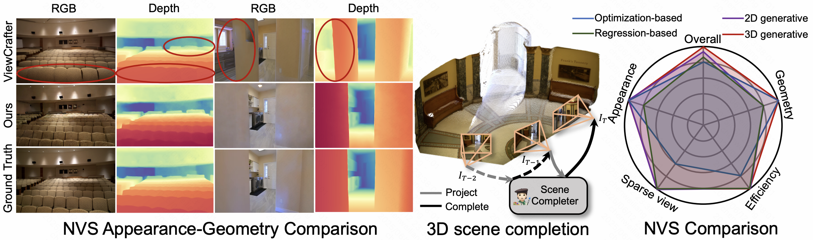
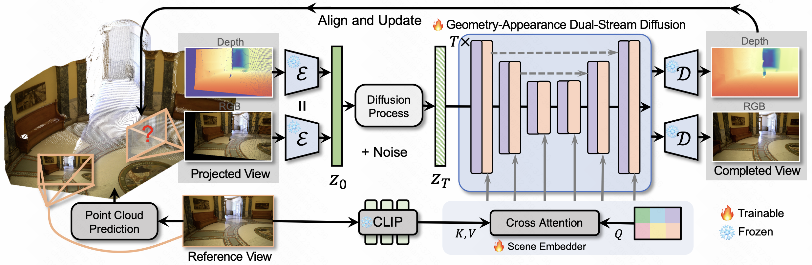
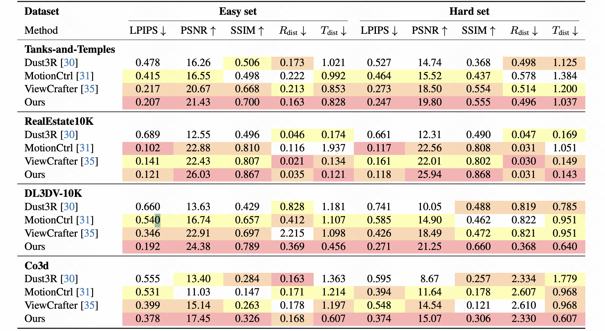

# SceneCompleter: Dense 3D Scene Completion for Generative Novel View Synthesis

[**Paper**](https://arxiv.org/abs/2506.10981) | [**Project Page**](https://chen-wl20.github.io/SceneCompleter//)

> Official implementation of SceneCompleter: Dense 3D Scene Completion for Generative Novel View Synthesis.

> [Weiliang Chen](https://chen-wl20.github.io/), Jiayi Bi, [Yuanhui Huang](https://huang-yh.github.io/), [Wenzhao Zheng](https://wzzheng.net/)$\dagger$, [Yueqi Duan](https://duanyueqi.github.io/)$\ddagger$

$\dagger$ Project leader $\ddagger$ Corresponding author

<p align="center"> All Code will be released soon... 🏗️ 🚧 🔨</p>

Abstract: *Generative models have gained significant attention in novel view synthesis (NVS) by alleviating the reliance on dense multi-view captures. However, existing methods typically fall into a conventional paradigm, where generative models first complete missing areas in 2D, followed by 3D recovery techniques to reconstruct the scene, which often results in overly smooth surfaces and distorted geometry, as generative models struggle to infer 3D structure solely from RGB data. In this paper, we propose **SceneCompleter**, a novel framework that achieves 3D-consistent generative novel view synthesis through dense 3D scene completion. SceneCompleter achieves both visual coherence and 3D-consistent generative scene completion through two key components: (1) a geometry-appearance dual-stream diffusion model that jointly synthesizes novel views in RGBD space; (2) a scene embedder that encodes a more holistic scene understanding from the reference image. By effectively fusing structural and textural information, our method demonstrates superior coherence and plausibility in generative novel view synthesis across diverse datasets.*

<p align="center">
    
</p>

<!-- ## Method
We first extract the geometry-appearance clues from the reference view using an unconstrained stereo reconstruction method. Then, we employ a Geometry-Appearance Dual-Stream Diffusion model to generate novel view in 3D space, conditioned on the extracted geometry-appearance clues. After generating the 3D novel view, we align the synthesized geometry with the original 3D structure to achieve 3D scene completion. Notably, this process can be iterated to progressively generate a larger 3D scene.
<p align="center">
    
</p> -->

## Qualitative Results

Qualitative comparison of zero-shot novel view synthesis on Tanks-and-Temples, RealEstate10K, DL3DV10K, CO3D datasets. Our SceneCompleter achieves more realistic and 3D-consistent novel view synthesis.
<p align="center">
    
</p>

## Quantitative Results

Quantitative comparison of zero-shot novel view synthesis on Tanks-and-Temples, RealEstate10K, DL3DV10K, and CO3D dataset. Our SceneCompleter outperforms baselines across most image quality and pose accuracy metrics.

<p align="center">
    
</p>

<!-- 
## Acknowledgement -->


## BibTeX

```
@misc{chen2025scenecompleterdense3dscene,
        title={SceneCompleter: Dense 3D Scene Completion for Generative Novel View Synthesis}, 
        author={Weiliang Chen and Jiayi Bi and Yuanhui Huang and Wenzhao Zheng and Yueqi Duan},
        year={2025},
        eprint={2506.10981},
        archivePrefix={arXiv},
        primaryClass={cs.CV},
        url={https://arxiv.org/abs/2506.10981}, 
  }
```
